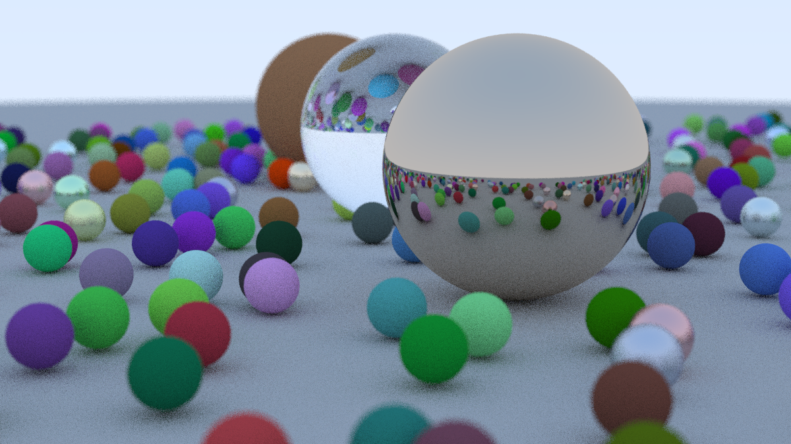

Hi there 👋, my name is Li Boxiu, an undergraduate from Huazhong University Of Science And Technology(hust).

I like building things and learning new stuff and I’m experienced in writing code in Golang/Rust/PHP/C#.

I'm currently focus on building a new language called [Pivot Lang](https://github.com/Pivot-Studio/pivot-lang).

If you want to chat, just drop me an email.

I'm also a big fan of open source, here's a list of some projects I've built:

### 1. [Pivot Lang](https://pivotlang.tech/)

A Rust-like language with immix gc and other cool stuffs, I've implement
the well-known tutorial [Ray Tracing In One Weekend](https://github.com/Pivot-Studio/rtweekend-pl)
in it.

### 2. [Blazor.Cropper](https://github.com/Chronostasys/Blazor.Cropper)

A blazor library provide a component to crop image, written in almost pure C#, has ability to crop moving gif.
=>  
   

### 3. [Immix GC](https://github.com/Chronostasys/immix)

The well known immix garbage collector implementation in Rust. Can be integrate easily into
any language using LLVM as backend.
