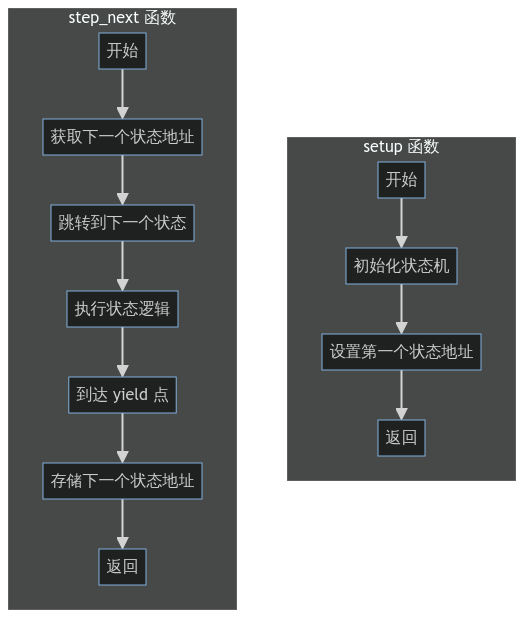

好吧，异步难产了这么久，我终于鼓起勇气给他解决了。
完成异步状态机的逻辑花了我大概一天的时间，而这次我也保持了我的优良传统--
想到哪写到哪，没有先输出文档。但是async/await这个领域的底层原理，很多
开发团队的同学，包括几天前的我自己，都没有完全理解。而这些知识对于异步接口
的封装又是至关重要的，所以我决定写一系列的文章来仔细讲解这个问题。

由于大部分同学都是中文使用者，秉持实用主义的原则，我决定用中文写这个系列的文章。
等我以后有空了，再把这个翻译成英文（大概）。

## 为什么要实现异步？

初学者的一个常见误区是将异步和多线程混淆。实际上，异步和多线程是两个不同的概念。
举例来说，如果你需要完成两项工作：洗碗和炒菜，那么如果你能够同时做这两件事，就是多线程。
在这种情况下，`单纯`的异步帮助不了你很多（尽管有些异步操作确实是用多线程做的trick，但是我们这里
暂时不考虑）。而如果你需要洗碗和烧水，你把水壶放在火上烧水，然后开始洗碗，
洗完碗的时候水也烧好了，这种做事的方式就是异步。

如果比较上方多线程和异步的差别，很容易发现规律：多线程对应的情况，是需要两个人同时干活（很明显一个人
无法同时洗碗和炒菜），而异步对应的情况，是一个人通过合理的安排，在等待任务完成的时候，去做其他事情。
显然异步的情况也可以通过多线程进行优化：如果我有两个人，我也可以让一个人烧水另一个人洗碗。

既然异步做的事情，多线程也可以做，那么为什么我们还要实现异步呢？这个问题的答案是：异步更加高效。
在上面的例子中，同时进行洗碗和烧水，使用多线程的方式的话我们需要两个人，而使用异步的方式，我们只需要一个人，
而这两种方案最终的结果是一样的。这就是异步的优势：在不增加资源的情况下，提高效率。

现在我们考虑编程中的情况，如果我们有一个http服务器，在不使用异步的情况下，我们的主线程在等待网络请求的时候，
是无法做其他事情的。而如果我们使用异步的方式，主线程就可以在等待网络请求的时候，去运行其他的逻辑。
**这种异步功能对于一些单线程的语言极其重要** ，例如`js`，`python`等，如果 `js` 不支持异步，
那么node.js服务器就无法同时处理多个请求。即使是多线程的语言，异步也是非常重要的，他能以相比多线程更加轻量的方式，
提供并发的能力。因此`async/await`也被称作 **无栈协程** 。

## 异步的实现

一般来说，异步代码在编译期间会展开为状态机。状态机其实就是一种协程，他可以在运行途中暂停和继续。下面我们看一个普通状态机的例子：

```Rust
gen fn generator1() Iterator<i64> {
    yield return 1;
    yield return 2;
    yield return 3;
}
```

这个状态机有三个可以暂停的位置，分别返回了1，2，3，直接执行它并不会执行七函数体内的任何代码，而是会返回一个`Iterator`对象，我们可以通过这个对象来控制这个状态机的执行。

异步状态机和普通状态机是很类似的，他们的主要区别表现在以下几点：

1. 普通状态机在`yield`的时候暂停，而异步状态机在`await`的时候暂停。
2. 普通状态机函数每次暂停都会返回一次数据，而异步状态机一般只有最后一次暂停才会返回数据（对应`async`函数中的`return`语句）。
3. 普通状态机一般需要用户手动调用`next`来进行调度，而异步状态机一般由语言内置的运行时来调度。

### 状态机的ir生成

一个状态机通常会被编译成两个函数，一个是初始化状态机的函数，一个是状态机的状态转移函数（也就是普通状态机的`next`函数）。状态机其实就是一片内存空间，其中保存着不同状态转换的时候需要存活的变量，还有下一个状态对应的地址。状态转移函数的第一个`block`的逻辑就是从状态机中取出下一个状态的地址并跳转，跳转之后执行完对应逻辑，直到对应yield的地方，存入下一个状态对应的地址，返回。而状态机的初始化函数的主要工作则是将第一个状态的地址赋值给状态机中对应的指针。



### 将async/await编译成状态机

现在，我们已经知道如何编译状态机了，那么如何将`async/await`转换成状态机呢？

想要理解这个问题，首先我们需要思考我们想实现的功能到底是什么。为什么`async/await`能够成为异步的一种抽象呢？根据我们之前的例子，我们可以得出结论：适合异步的任务是那种开始执行之后，会消耗一定时间完成且不怎么需要本机cpu参与的任务。异步的目标就是让我们能在等待这种任务完成的时候，去做其他事情。那么如何用代码来表达这种任务呢？我们假设他可以使用一个叫`Task`的trait来表示，那么我们应该可以时不时的查看它是否运行完成，所以它应该有个`poll`方法，该方法在任务没有完成的时候返回`None`完成后返回对应的值，那么我们的`Task`应该长这样：

```Rust
trait Task<T> {
    fn poll() Option<T>;
}
```

容易注意到，这个结构似乎和上一个章节中的状态机函数返回的结构具有类似的性质：`poll`函数类似状态转移函数，`Task<T>`接口则类似状态机，那么我们能否将`async/await`转换成返回上述变种状态机的函数，和一个状态转移函数？请看下方伪代码：

```Rust
async fn async_f1() Task<()> {
    let re:() = await doTask();
    return re;
}
```

转化为：

```Rust
fn async_f1() Task<()> {
    return GeneratedCtx{
        block_addr: initial_addr
    } as Task<()>;
}

fn async_f1_next_state(ctx: *GeneratedCtx) Option<()> {
    let task = doTask();
    let re = task.poll(wk);
    while re is None {
        yield return None;
        re = task.poll(wk);
    }
    let ret = re as ()!;
    return ret as Option<()>;
}
```

可以看出只在普通状态机上做了点微小的改拜年，我们就实现了异步状态机。

### 真异步操作的包装

TODO
